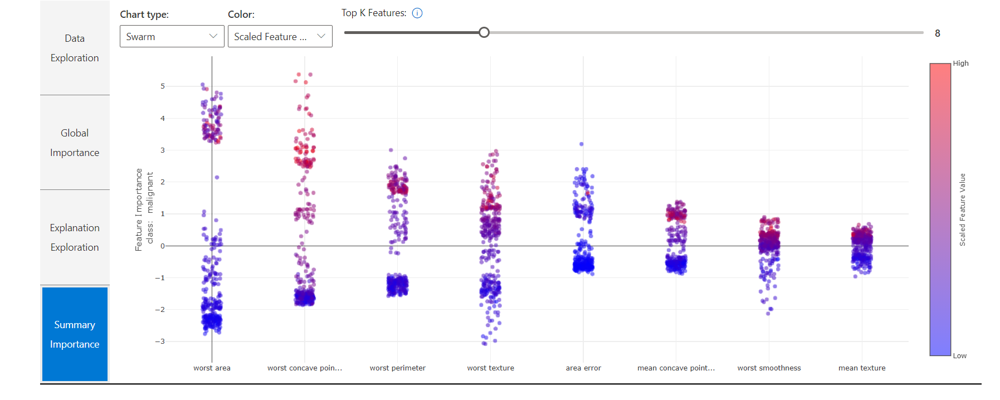

[](https://mybinder.org/v2/gh/nemasobhani/InterpretableML/master?filepath=Interpretable%20ML%20at%20Avanade%20ITS.ipynb)

# Interpretable ML @ Avanade ITS


EmTech V-Team - Explainable AI  

**Nema Sobhani  
IT Analytics, Avanade**


## Objective

**Explainability/interpretability overview and demonstration of ML tools in the Azure stack used at Avanade.**

## Agenda

I. [Background](#Background)
- [Why do we need Interpretable ML?](#Why?)
- [SHAP!](#SHAP)
- [MSFT's Interpretability Offerings](#MSFT)


II. [In Action](#InAction)
- [Dummy Example](#Dummy)
- [Avanade Interpretability VM](#AvaInterpVM)


III. [Other Approaches](#Other)
- [Different Methods](#Methods)
- [Competing offerings](#Competing)


IV. [Wrap-up](#Wrap)
- [Questions](#Questions)
- [Sources/Suggested Reading](#Sources)
- [Packages](#Packages)

## I. Background <a id='Background'></a>

Do to our unique relationship with Microsoft, we have been given direct access to product owners for Microsoft's cutting edge machine learning, interpretability, and explainability tools including interpret-ml, interpret-community, and the azureml sdk (May Hu, Mehrnoosh Sameki, Ilya Matiach).

### Why do we need Intepretable ML? <a id='Why?'></a>

_"The goal of science is to gain knowledge, but many problems are solved with big datasets and black box machine learning models. The model itself becomes the source of knowledge instead of the data. Interpretability makes it possible to extract this additional knowledge captured by the model."_

\- **Christoph Molnar**, _‘Interpretable Machine Learning’_


**Applications**
- Financial Services/Banking (fraud detection)
- Marketing (user engagement)
- Healthcare (individualized medicine and tracking)
- Epidemiology (disease outbreak modeling)

**Benefits**
- Validation of domain knowledge
- Provides actionable evidence  
- Guides data practices and feedback


### SHAP! <a id='SHAP'></a>

**SH**apley **A**dditive ex**P**lanations

Gives both globally and locally accurate and consistent feature importance values derived from individual contributions (drawn from Lloyd Shapley's work in combinatorial game theory).  
  
Ideal for use with opaque models (boosted tree, kernel-based, NN, etc).

### MSFT's Interpretability Offerings <a id='MSFT'></a>

Microsoft addressed the need for a unified API that makes it easy to get model explanation/feature importances based on various model types, built in to their machine learning platform. 

- From the SDK
    - `pip install --upgrade azureml-sdk[explain,interpret,notebooks]`
- Only interpretability package
    - `pip install interpret-community`

Using the `TabularExplainer` object, the model type is detected and the appropriate SHAP explainer is selected to generate feature importances.

| Original Model | Invoked Explainer |
| :-- | :-- |
| Tree-based models | SHAP TreeExplainer |
| Deep Neural Network models | SHAP DeepExplainer |
| Linear models | SHAP LinearExplainer |
| None of the above | SHAP KernelExplainer |

This package also supports a Mimic Explainer (Global Surrogate) and a Permutation Feature Importance Explainer (PFI), both of which are model-agnostic and will be covered later.

## II. In Action <a id='InAction'></a>

### Dummy Example <a id='Dummy'></a>

Scikit-Learn Breast Cancer Binary Classification

Pip installations:

`pip install numpy, pandas, sklearn, lightgbm, interpret-community[visualization]`


```python
import numpy as np
import pandas as pd
import sklearn.datasets as datasets
from sklearn.model_selection import train_test_split
from sklearn.metrics import confusion_matrix, classification_report
import lightgbm as lgbm
```


```python
# Load and partition data
data = datasets.load_breast_cancer()

X = data.data
y = data.target # 0 = malignant, 1 = benign
feature_names = data.feature_names.tolist()
classes = data.target_names.tolist()

X_train, X_test, y_train, y_test = train_test_split(X, y, test_size=0.2, random_state=42, stratify=y)
X_train, X_valid, y_train, y_valid = train_test_split(X_train, y_train, test_size=0.25, random_state=42, stratify=y_train) 
```


```python
# Model training
clf = lgbm.LGBMClassifier()

clf.fit(
    X=X_train,
    y=y_train,
    eval_set=[(X_valid, y_valid)],
    eval_metric='auc',
    feature_name=feature_names,
    verbose=25
)

y_pred = clf.predict(X_test)

print('\nConfusion Matrix: \n', confusion_matrix(y_test, y_pred))
print('\nClassification Report: \n', classification_report(y_test, y_pred))
```

    [25]	valid_0's auc: 0.989519	valid_0's binary_logloss: 0.145683
    [50]	valid_0's auc: 0.987226	valid_0's binary_logloss: 0.136426
    [75]	valid_0's auc: 0.986243	valid_0's binary_logloss: 0.172291
    [100]	valid_0's auc: 0.989846	valid_0's binary_logloss: 0.189166
    
    Confusion Matrix: 
     [[40  2]
     [ 3 69]]
    
    Classification Report: 
                   precision    recall  f1-score   support
    
               0       0.93      0.95      0.94        42
               1       0.97      0.96      0.97        72
    
        accuracy                           0.96       114
       macro avg       0.95      0.96      0.95       114
    weighted avg       0.96      0.96      0.96       114
    
    


```python
# Feature Importance (SHAP)
from interpret_community import TabularExplainer

explainer = TabularExplainer(clf, initialization_examples=X_train, features=feature_names, classes=classes)
```


```python
# Global Feature Importances
global_explanation = explainer.explain_global(X_train)
display(pd.DataFrame.from_dict(global_explanation.get_feature_importance_dict(), orient='index', columns=['SHAP Value']).head(10))
```


<div>
<table border="1" class="dataframe">
  <thead>
    <tr style="text-align: right;">
      <th></th>
      <th>SHAP Value</th>
    </tr>
  </thead>
  <tbody>
    <tr>
      <th>worst area</th>
      <td>2.341634</td>
    </tr>
    <tr>
      <th>worst concave points</th>
      <td>1.823587</td>
    </tr>
    <tr>
      <th>worst perimeter</th>
      <td>1.361179</td>
    </tr>
    <tr>
      <th>worst texture</th>
      <td>1.167765</td>
    </tr>
    <tr>
      <th>area error</th>
      <td>0.810253</td>
    </tr>
    <tr>
      <th>mean concave points</th>
      <td>0.637934</td>
    </tr>
    <tr>
      <th>worst smoothness</th>
      <td>0.334095</td>
    </tr>
    <tr>
      <th>mean texture</th>
      <td>0.311042</td>
    </tr>
    <tr>
      <th>worst radius</th>
      <td>0.200612</td>
    </tr>
    <tr>
      <th>mean smoothness</th>
      <td>0.200187</td>
    </tr>
  </tbody>
</table>
</div>


```python
# Local Feature Importances (for predicting benign class)
shap = global_explanation.local_importance_values[1]

df_shap = pd.DataFrame(shap, columns=feature_names)
display(df_shap.head())
```


<div>
<table border="1" class="dataframe">
  <thead>
    <tr style="text-align: right;">
      <th></th>
      <th>mean radius</th>
      <th>mean texture</th>
      <th>mean perimeter</th>
      <th>mean area</th>
      <th>mean smoothness</th>
      <th>mean compactness</th>
      <th>mean concavity</th>
      <th>mean concave points</th>
      <th>mean symmetry</th>
      <th>mean fractal dimension</th>
      <th>...</th>
      <th>worst radius</th>
      <th>worst texture</th>
      <th>worst perimeter</th>
      <th>worst area</th>
      <th>worst smoothness</th>
      <th>worst compactness</th>
      <th>worst concavity</th>
      <th>worst concave points</th>
      <th>worst symmetry</th>
      <th>worst fractal dimension</th>
    </tr>
  </thead>
  <tbody>
    <tr>
      <th>0</th>
      <td>-0.021539</td>
      <td>0.321744</td>
      <td>-0.021727</td>
      <td>-0.001728</td>
      <td>-0.782009</td>
      <td>0.013229</td>
      <td>-0.071580</td>
      <td>-0.124397</td>
      <td>-0.043490</td>
      <td>-0.034941</td>
      <td>...</td>
      <td>0.188589</td>
      <td>1.557899</td>
      <td>1.157621</td>
      <td>2.275592</td>
      <td>-0.408454</td>
      <td>-0.001883</td>
      <td>0.029665</td>
      <td>1.730362</td>
      <td>0.047198</td>
      <td>-0.109017</td>
    </tr>
    <tr>
      <th>1</th>
      <td>-0.126181</td>
      <td>-0.371998</td>
      <td>-0.073260</td>
      <td>-0.001627</td>
      <td>-0.214240</td>
      <td>-0.027172</td>
      <td>-0.291059</td>
      <td>-0.304990</td>
      <td>-0.199762</td>
      <td>-0.004075</td>
      <td>...</td>
      <td>-0.041869</td>
      <td>-2.656456</td>
      <td>-2.995181</td>
      <td>-0.203860</td>
      <td>-0.740862</td>
      <td>0.005230</td>
      <td>-0.307423</td>
      <td>-0.285139</td>
      <td>-0.441779</td>
      <td>-0.004399</td>
    </tr>
    <tr>
      <th>2</th>
      <td>0.003145</td>
      <td>0.339770</td>
      <td>-0.035467</td>
      <td>-0.001743</td>
      <td>-0.745712</td>
      <td>0.039464</td>
      <td>0.062067</td>
      <td>0.488236</td>
      <td>-0.047262</td>
      <td>-0.037220</td>
      <td>...</td>
      <td>0.035996</td>
      <td>1.199373</td>
      <td>1.354136</td>
      <td>1.989123</td>
      <td>-0.379708</td>
      <td>0.062644</td>
      <td>0.059645</td>
      <td>1.566148</td>
      <td>-0.050104</td>
      <td>0.031548</td>
    </tr>
    <tr>
      <th>3</th>
      <td>0.067903</td>
      <td>0.657175</td>
      <td>0.012231</td>
      <td>0.003307</td>
      <td>0.123375</td>
      <td>-0.365281</td>
      <td>0.033967</td>
      <td>0.533232</td>
      <td>0.012120</td>
      <td>0.062579</td>
      <td>...</td>
      <td>0.079415</td>
      <td>2.114178</td>
      <td>0.219407</td>
      <td>1.221378</td>
      <td>0.153687</td>
      <td>0.045893</td>
      <td>0.045342</td>
      <td>1.441597</td>
      <td>0.435639</td>
      <td>-0.054577</td>
    </tr>
    <tr>
      <th>4</th>
      <td>-0.055729</td>
      <td>-0.170627</td>
      <td>-0.046742</td>
      <td>-0.002422</td>
      <td>-0.724170</td>
      <td>0.009585</td>
      <td>-0.229870</td>
      <td>-0.462293</td>
      <td>-0.172071</td>
      <td>-0.042171</td>
      <td>...</td>
      <td>-0.077372</td>
      <td>-2.193885</td>
      <td>1.002135</td>
      <td>2.284974</td>
      <td>-0.459759</td>
      <td>-0.027261</td>
      <td>-0.353700</td>
      <td>-5.373368</td>
      <td>-0.290265</td>
      <td>-0.026400</td>
    </tr>
  </tbody>
</table>
<p>5 rows × 30 columns</p>
</div>


```python
# Visualization
from interpret_community.widget import ExplanationDashboard

display(ExplanationDashboard(global_explanation, clf, datasetX=X_train, trueY=y_train))
```




### Avanade Interpretability VM (Demo) <a id='AvaInterpVM'></a>

## III. Other Approaches <a id='Other'></a>

### Different Methods <a id='Methods'></a>

#### **L**ocal **I**nterpretable **M**odel-agnostic **E**xplanations (LIME)

Explainable surrogate models are trained on the _predictions_ of the opaque model, therefore allowing local, interpretable explanations. No guarantee to be globally relevant.

#### Global Surrogates Models (Mimic Explainers)

Same as LIME, but applied to global scale. Must be an interpretable model (tree or linear) that trains on the original data with the addition of the predicted label of the opaque model.

#### Permutation Feature Importance (PFI)

Shuffles dataset, feature by feature and measures effect on performance metric. Larger changes are attributable as more important features.

#### Diverse Counterfactual Explanations (DiCE)

Uses feature perturbations to give actionable outcomes on requirements to shift between classes.

ie. If credit score was > 700, user X would likely move into the "Loan Approved" classification.


### Competing offerings <a id='Competing'></a>

**AWS Sagemaker Debugger** just recently started utilizing the shap package microsoft has integrated into azure ml, contrasting the maturity of Microsoft's early investment in explainable AI.

**Oracle's "Skater"**, is a python package that supports local interpretation using LIME and global interpretation using scalable bayesian rule lists and tree surrogates. The documentation is rather sparse and there doesn't seem to be any momentum to expand to other methods. 

**Scikit-learn**'s built-in feature importances provide some value for simple models, but lack the depth and versatility of msft's `interpret-community`.

**Explain like I’m 5 (ELI5)** uses LIME and PFI on opaque models and offers specialized support for text classifiers. Does not offer any visual utilities or shap.

The webapp, **ml-interpret**, is an online-only platform where a dataset may be uploaded and a model selected to explain outcomes of opaque models, but there is practically no customizability and the user is size-restricted.

## IV. Wrap-up <a id='Wrap'></a>

### Questions <a id='Questions'></a>

### Sources/Suggested Reading <a id='Sources'></a>

[Molnar, Christoph. "Interpretable machine learning. A Guide for Making Black Box Models Explainable", 2019](https://christophm.github.io/interpretable-ml-book/)  
[Lundberg SM et al. "A Unified Approach to Interpreting Model Predictions", NIPS 2017](https://papers.nips.cc/paper/7062-a-unified-approach-to-interpreting-model-predictions.pdf)  
[Shapley, LS. "Notes on the n-Person Game -- II: The Value of an n-Person Game", 1951](https://www.rand.org/content/dam/rand/pubs/research_memoranda/2008/RM670.pdf)

### Packages <a id='Packages'></a>

https://github.com/slundberg/shap  
https://github.com/interpretml/interpret-community  
https://github.com/interpretml/DiCE  
https://github.com/TeamHG-Memex/eli5  
https://github.com/oracle/Skater
http://ml-interpret.herokuapp.com/
